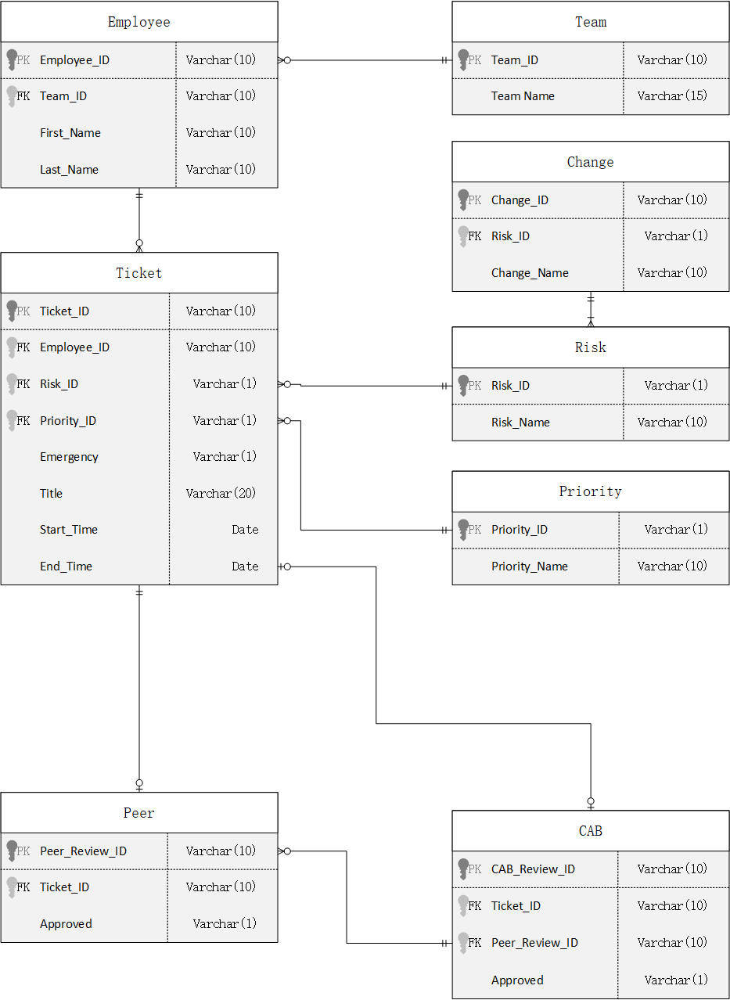

# Business Tickets System

Change management is a business process in the field of IT that allows for the tracking, approval, and notification of important changes, as well as the determination of potential outages. 

Implementing a system for change management enables technicians to reference past changes, facilitating the identification and resolution of unintended consequences. For instance, if users encounter an issue with an enterprise application following a change made earlier in the week, the change management system can be consulted to determine whether the change may have caused the issue, and if necessary, the change can be reverted.

The project is intended to improve the change management process for the Student Affairs Information Technology department.



# Example Reports

**Employees with the highest number of tickets.** The report shows the employee ID, their first, last name and the total number of tickets. It shows how employee_id 14 and 2 have each two tickets submitted. This type of report would be beneficial to see what employees are submitting multiple tickets as there may be issues with the system and we are seeing an increase in submissions. It can also shed light on whether some employees are having barriers in accessing the system or being able to complete their assignments. This is particularly important if we are seeing that particular employees have a large number of ticket requests as this may hinder productivity or delay a task.

```
select 
  ticket.employee_id, 
  employee.first_name, 
  employee.last_name, 
  count(ticket.employee_id) as num_of_tkts 
from 
  ticket 
  inner join employee on ticket.employee_id = employee.employee_id 
group by 
  ticket.employee_id, 
  employee.first_name, 
  employee.last_name;
```

